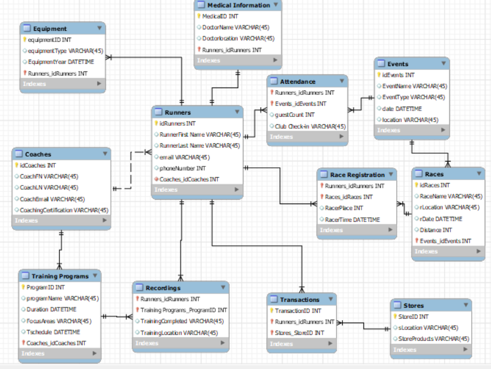

# SQL-Project-1
MIST 4610 - SQL Project 1 

Problem Description: 
Pretend you are the owner/operator of a RUNNING association (club)
needing to build a relational database. You hired some students from the MIST 4610 class at
the University of Georgia to create the database for you. They need to know more about your
organization to identify which entities, attributes, and relationships are important for you.
Start by describing your business as a real client.

CHATGPT Response: 
As the owner/operator of a running club, our organization is dedicated to promoting health, fitness, and community through the sport of running. We provide a variety of services and activities tailored to runners of all ages and abilities, fostering a supportive environment where individuals can pursue their running goals and connect with like-minded enthusiasts.

Here's a snapshot of our running club:

Group Runs: We organize regular group runs at various locations, including trails, parks, and urban routes, catering to different distances and paces. These group runs serve as opportunities for members to train together, socialize, and enjoy the camaraderie of fellow runners.

Coaching and Training Programs: Our club offers coaching services and structured training programs led by experienced coaches and trainers. These programs are designed to help runners improve their performance, set and achieve personal goals, and stay motivated through structured workouts and personalized guidance.

Events and Races: We host and participate in various running events and races throughout the year, including fun runs, charity races, and competitive events. These events provide members with opportunities to challenge themselves, showcase their skills, and engage in friendly competition within the running community.

Workshops and Seminars: We organize educational workshops, seminars, and guest speaker events covering topics such as nutrition, injury prevention, race strategy, and mental preparation. These events offer valuable insights and resources to help runners enhance their training and overall well-being.

Community Engagement: Our club actively engages with the local community through outreach initiatives, volunteer opportunities, and partnerships with schools, businesses, and other organizations. We seek to promote the benefits of running, encourage participation in physical activity, and support charitable causes aligned with our mission.

Membership: We offer membership options with various benefits, including access to club resources, discounts on coaching services and merchandise, priority registration for events, and exclusive member-only activities.

Equipment and Gear: Our club may provide access to equipment and gear, such as running apparel, shoes, hydration packs, and safety accessories, either through partnerships with vendors or through a club-owned inventory.

Given this overview, the database should encompass key entities such as Members, Coaches, Events, Races, Training Programs, Workshops, Community Partnerships, Equipment, and Transactions, along with their associated attributes and relationships to effectively manage club operations, member registrations, event planning, coaching services, and inventory tracking.

Data Model: 

